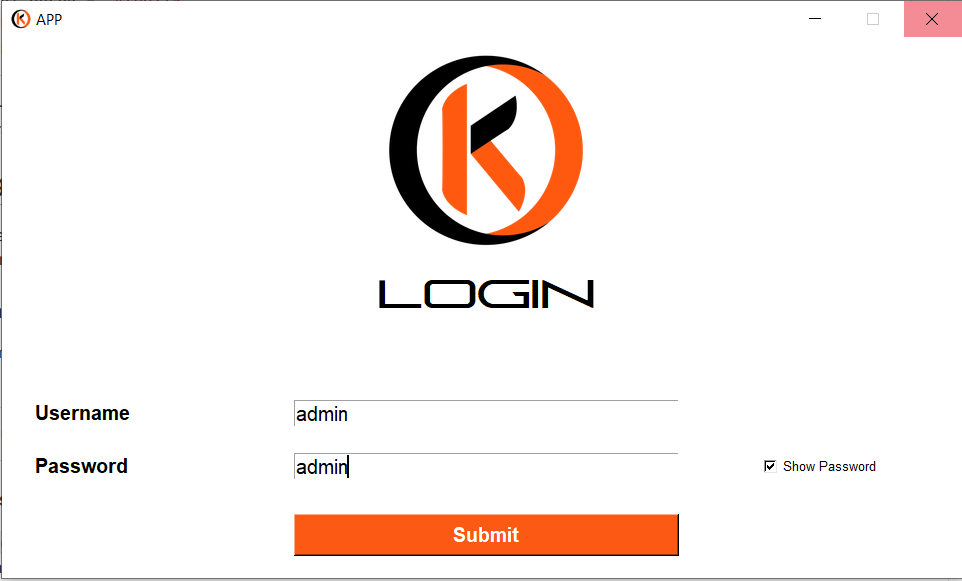

# Yenega Framework

Bienvenue dans le framework Yenega ! Ce framework Python exploite la bibliothèque tkinter pour construire facilement et rapidement des applications de sécurité informatique desktop multiplateforme destinées aux professionnels de la sécurité.

## Prérequis

Avant d'utiliser le framework Yenega, assurez-vous d'avoir les éléments suivants installés sur votre système :

- [Python 3](https://www.python.org/downloads)
- [Git](https://git-scm.com/downloads)

## Installation (initialisation)

1. Cloner l'installateur [yenega-installer](https://gitlab.com/yenega/yenega-installer.git)
```bash
git clone https://gitlab.com/yenega/yenega-installer.git
```
Créez ensuite un projet:

```bash
python path/vers/yenega-installer.py new NomDuProjet
```

Pour plus de détails, consultez la documentation officielle [ici](https://gitlab.com/yenega/yenega-installer).

> Remarque: N'oubliez pas de naviguer dans le dossier du projet nouvellement créé pour la suite.

2. Configurer les paramètres du projet. Voir la section [Configuration du Projet](#1-configuration-du-projet).

3. Effectuer une migration. Pour plus de détails, voir la section [Migration de la Base de Données](#2-migration-de-la-base-de-données)
```bash
python path/vers/yenega.py migrate
```

4. Générer un accès admin. Pour plus de détails, voir la section [Commande de Peuplement de la Base de Données](#3-commande-de-peuplement-de-la-base-de-données)
```bash
python path/vers/yenega.py seed --admin
```

5. Lancer l'application.
```bash
python path/vers/yenega.py start
```
Les informations de connexion sont les suivantes:
**Username:** `admin`
**Password:** `admin`



## 1. Configuration du Projet

Avant de commencer à utiliser le framework Yenega, assurez-vous de configurer les paramètres appropriés dans le fichier `env.py`. Ces paramètres définissent des configurations essentielles pour le bon fonctionnement de l'application.

## Fichier `env.py`

Assurez-vous de définir correctement les valeurs des paramètres suivants dans le fichier `env.py` de votre projet :

### Description des Paramètres :

- `LANG`: Langue par défaut de l'application.
- `APP_NAME`: Nom de l'application.
- `DATABASE`: Type de base de données utilisé.
- `DATABASE_HOST`: Adresse du serveur de base de données.
- `DATABASE_NAME`: Nom de la base de données.
- `DATABASE_USER`: Nom d'utilisateur de la base de données. *(Par défaut: "root")*
- `DATABASE_PASSWORD`: Mot de passe de la base de données. *(Par défaut: "root")*

**Remarque:** Assurez-vous que `DATABASE_USER` et `DATABASE_PASSWORD` correspondent à l'utilisateur et au mot de passe de votre installation MySQL. Par défaut, le nom d'utilisateur est 'root' et le mot de passe est vide. Cependant, cela peut varier en fonction de votre configuration.

- `LOGO_ICO`: Chemin vers le fichier ICO du logo de l'application. *(Placez l'image dans le dossier "resource/image/logo/")*
- `LOGO_PNG`: Chemin vers le fichier PNG du logo de l'application. *(Placez l'image dans le dossier "resource/image/logo/")*
  
N'oubliez pas de mettre à jour ces valeurs en fonction de votre configuration spécifique.

### Exemple d'Utilisation :

```python
# Exemple pour une application en français avec une base de données MySQL

LANG = "fr"
APP_NAME = "APP"

DATABASE = "mysql"
DATABASE_HOST = "localhost"
DATABASE_NAME = "yenega"
DATABASE_USER = "root"
DATABASE_PASSWORD = "root"

LOGO_ICO = "\\resource\\image\\logo\\logo.ico"
LOGO_PNG = "\\resource\\image\\logo\\logo.png"

PRIMARY_COLOR = "#fc5914"
SECONDARY_COLOR = "black"
BACKGROUND_COLOR = "white"
```

Assurez-vous que ces configurations correspondent à votre environnement et à vos préférences. Pour plus d'informations sur la configuration, consultez la documentation du framework Yenega.

## 2. Migration de la Base de Données

Le framework Yenega requiert une base de données, et la création de l'ensemble des tables se fait à travers le processus de migration.

### Commande de Migration

La commande `migrate` est utilisée pour gérer la migration de la base de données. Exécutez la commande suivante dans votre terminal :

```bash
python path/vers/yenega.py migrate
```

#### Options de la Commande `migrate` :

- `--refresh`: Rafraîchit la base de données en supprimant toutes les tables avant d'effectuer la migration. Utilisez la commande suivante :
```bash
python path/vers/yenega.py migrate --refresh
```

- `--reset`: Supprime toutes les tables de la base de données. Utilisez la commande suivante :
```bash
python path/vers/yenega.py migrate --reset
```

Assurez-vous d'être dans le répertoire du projet et d'avoir activé l'environnement virtuel si nécessaire avant d'exécuter ces commandes. Ces options offrent une flexibilité supplémentaire lors de la gestion des migrations de base de données pour votre projet Yenega.

### 3. Commande de Peuplement de la Base de Données

Le framework Yenega nécessite une authentification, ce qui implique la création d'un accès pour se connecter.

#### Options de la Commande `seed` :

- `--admin`: Crée un accès administrateur avec les identifiants "admin" et le mot de passe haché de "admin". Utilisez la commande suivante :
```bash
python path/vers/yenega.py seed --admin
```

- `--force`: Force la recréation de l'accès administrateur s'il existe déjà. Utilisez la commande suivante :
```bash
python path/vers/yenega.py seed --force
```

Assurez-vous d'être dans le répertoire du projet et d'avoir activé l'environnement virtuel si nécessaire avant d'exécuter ces commandes. Ces options permettent de gérer de manière flexible la création d'accès administrateur dans votre projet Yenega.

### 4. Mise à jour
Executer la commande suivante dans votre terminal pour mettre à jour votre projet avec les dernieres mise à jour du framework:

```bash
python path/vers/yenega.py update
```

### 5. Gestion des dépendences

**Installer ou mettre à jour les dépendences:**

Executer la commande suivante dans votre terminal pour mettre à jour toutes les dependences de votre projet:

```bash
python path/vers/yenega.py get
```

Pour mettre à jour une dépendence données:

```bash
python path/vers/yenega.py get --dependencies DependenceName
```

**Nettoyer ou supprimer toutes les dépendences:**

⚠️ **Avertissement : Utilisez cette commande avec précaution !**
Cette commande a le pouvoir de supprimer toutes les dépendances du projet. Assurez-vous d'avoir une sauvegarde ou une procédure de restauration en place avant de l'exécuter.

```bash
python path/vers/yenega.py clean
```

## Problèmes Connus

Si vous rencontrez des problèmes lors de l'utilisation du framework Yenega, veuillez consulter les sections "Problèmes Courants" ou "Contributions" dans le fichier [CONTRIBUTING.md](CONTRIBUTING.md) pour obtenir de l'aide.

## Contributions

Les contributions sont les bienvenues ! Consultez [CONTRIBUTING.md](CONTRIBUTING.md) pour obtenir des informations sur la manière de contribuer au projet.

***

&copy; 2024 [**B. Tanguy KABORE**](https://www.linkedin.com/in/kabore-tanguy-96ab94298/)